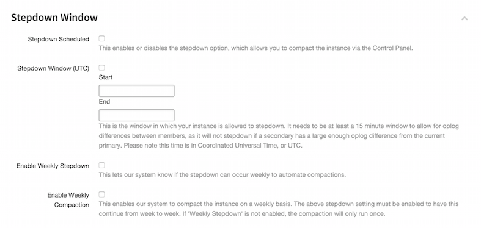
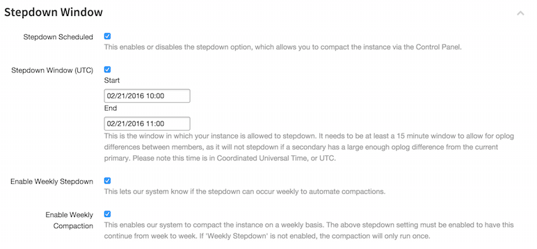

Automated Stepdown and Compaction Guide
=========================================

This guide will walk you through getting automated compactions setup for your instance.  Feel free to follow the corresponding links if you'd like more details on understanding `MongoDB space usage <http://objectrocket.com/blog/how-to/understanding-mongodb-space-usage>`_ or if you'd like a more behind the scences look at our `automated compaction process <http://objectrocket.com/blog/company/automated-online-compaction>`_.

What is a Stepdown?
--------------------
A stepdown is a graceful election of a new shard primary.  Since our shards come provisioned with 1 Primary and 2 Secondaries, the primary willingly gives up its status and allows one of the Secondaries to be promoted.  We use stepdowns to allow availability within the cluster while still being able to perform compactions and various maintenances on the instance.

What is a Compaction?
----------------------
A compaction is a two phase process during which your shard members (1 Primary and 2 Secondaries) are compacted behind the scenes, one at a time.  During the first phase, your secondaries are compacted. To move from phase one to phase two a stepdown needs to occur on the primary. The stepdown will take from 5-15 seconds, during which writes cannot take place. Most modern MongoDB drivers handle this type of operation gracefully, but in some rare cases an application restart may be required to clear stale connections. 

This being the case, we recommend that you schedule your stepdowns during non-peak hours. Once stepdown is completed, a compaction of the former primary occurs, thus compacting the whole instance.

Understanding the Stepdown Window Pane 
---------------------------------------

Once you select your MongoDB instance from the ObjectRocket UI and select the Settings button, you will be able to find the following section:

* Stepdown Scheduled: Is an on/off switch to ensure that stepdowns can or cannot occur.  We recommend that this is enabled so that your instance can automatically stepdown after a compaction has completed.
* Stepdown Window (UTC): Is the timeframe that your instance is allowed to begin compacting secondaries and/or stepdown the primary.  There is a minimum of 15 minutes to allow for oplog differences between membersi.  If possible, we recommend that this window is set to 30min to 1 hr.
* Enable Weekly Stepdown: Enabling this option allows stepdowns to occur during the Stepdown Window. We recommend that this is enabled to ensure that your stepdowns are occcuring during the non-peak hours specified in your Stepdown Window.
* Enable Weekly Compaction: Allows your instance to perform automated compactions during the Stepdown Window.  While compactions can be kicked off manually in the UI, we recommend enabling weekly compactions.  MongoDB will begin to fragment over time and this ensures that your instance maintains as small of a footprint on disk as possible.

If you have any further questions about compactions or stepdowns feel free to let us know by sending a ticket to `support@objectrocket.com <mailto:support@objectrocket.com>`_!  
