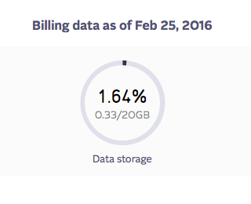

Parse Migration FAQ
===================

If you have any questions about anything in this FAQ, please don't hesitate to reach out to our `support team <mailto:support@objectrocket.com>`_!

Why migrate from Parse?
~~~~~~~~~~~~~~~~~~~~~~~

On January 28th 2016 Parse announced they'd be `shutting down their service <http://blog.parse.com/announcements/moving-on/>`_, leaving quite a few customers questioning where they'd be moving. Luckily we've worked closely with Parse on creating a MongoDB instance on our platform in several different sizes to fit any Parse customers needs.

With their help we're able to transition any current customer from their platform to ours, and our support is ready to jump in if you have any questions about the process.

.. note::

    Until March 31st 2016, the first Parse instance you create will have 15% off for a full year. Sign up `here <https://objectrocket.com/parse>`_!

Why use ObjectRocket?
~~~~~~~~~~~~~~~~~~~~~

ObjectRocket's MongoDB-as-a-Service makes it easy to deploy and run your database by providing a production-ready instance instantly, tools to automate operations, and a fully staffed team of engineers and database administrators so you can focus on your application. Here are the highlights:

    * Our tech stack is optimized for MongoDB from the ground up, including PCIe flash-based infrastructure, high memory-to-disk ratios, and container-based virtualization.
    * We have the best MongoDB support specialists and DBA experts, bar none, and 24x7x365 support, whether you are a 5GB or a 5TB customer.
    * We have competitive pricing with price breaks as your data needs grow.
    * We offer both the standard uncompressed MongoDB storage engine, MMAPv1, and the newer compressed storage engine that shipped with MongoDB 3.0, WiredTiger. WiredTiger is most comparable to RocksDB, the compressed storage engine your app used at Parse.

What size instance should I choose?
~~~~~~~~~~~~~~~~~~~~~~~~~~~~~~~~~~~

This can be a difficult decision due to the compression available in RocksDB, which is the MongoDB storage engine that Parse used. Parse recommends choosing a plan that is 10x the size of the `Data storage` listed under `Analytics` in your Parse dashboard. The image below shows an example of what this looks like:

Our Parse tuned instances are available in quite a few different sizes to fit your workload. Plan sizes are 20GB, 50GB, 100GB, 250GB, and 500GB for our compressed instances using WiredTiger. We also offer uncompressed MMAPv1 instances, designed for smaller deployments, available in 5GB and 20GB.

If you have any questions about what size to choose, we recommend reaching out to our `support team <mailto:support@objectrocket.com>`_.

Where should I host my Parse API server?
~~~~~~~~~~~~~~~~~~~~~~~~~~~~~~~~~~~~~~~~

As our MongoDB instances have ties to both Rackspace ServiceNet and AWS DirectConnect, we would recommend using `Rackspace Cloud <https://www.rackspace.com/en-us/cloud>`_ servers or an AWS instance in the US-East zone. Rackspace also offers support for AWS under our `Fanatical AWS <https://www.rackspace.com/en-us/managed-aws>`_ umbrella.

What do I do without auto-indexing?
~~~~~~~~~~~~~~~~~~~~~~~~~~~~~~~~~~~

ObjectRocket has some of the best MongoDB DBA's, and was founded by a MongoDB master with support in mind. Our DBA and Support staff are more than happy to help review any slow qeuries and implement the indexes on your behalf! We'll likely have a few more questions than you're used to, but rest assured we're very comfortable with code and gleaning the best possible performance from any query pattern.

Does ObjectRocket support the Parse Dashboard?
~~~~~~~~~~~~~~~~~~~~~~~~~~~~~~~~~~~~~~~~~~~~~~

Unfortunately the open source `Parse Server <https://github.com/ParsePlatform/parse-server>`_ does not include their dashboard. If you need to view collections and documents with a UI, we'd recommend `MongoChef <http://3t.io/>`_ or `Robomongo <https://robomongo.org/>`_.

Parse Resources
~~~~~~~~~~~~~~~

    * `Parse Server Installation Guide <https://github.com/ParsePlatform/parse-server>`_
    * `Migrating an Existing Parse Application <https://github.com/ParsePlatform/parse-server/wiki/Migrating-an-Existing-Parse-App>`_
    * `Parse Server Community Links <https://github.com/ParsePlatform/parse-server/wiki#community-links>`_
    * `Parse Server Development Guide <https://github.com/ParsePlatform/parse-server/wiki/Development-Guide>`_
